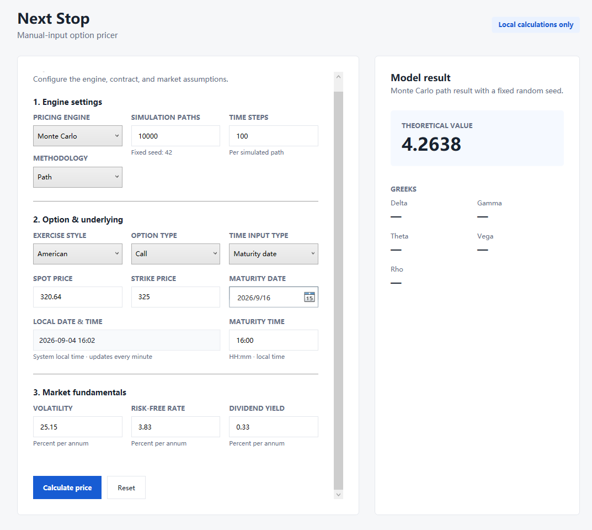
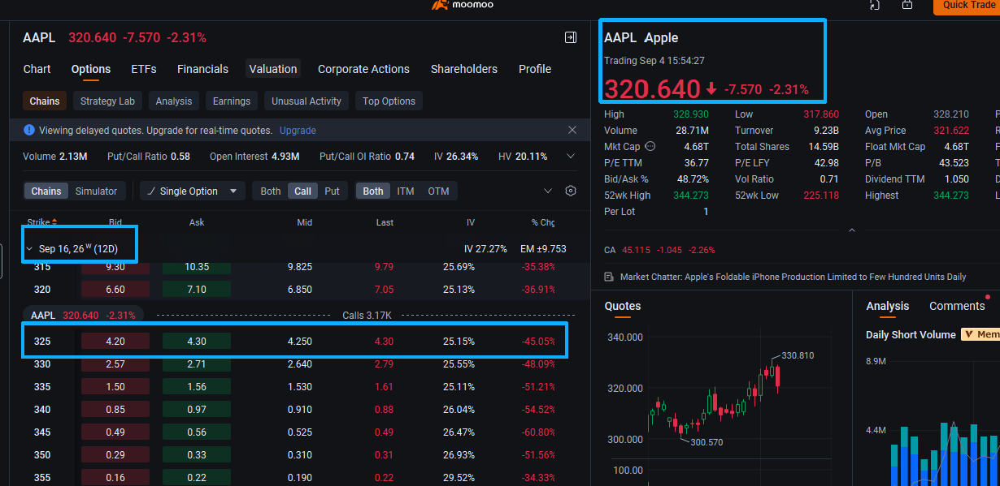

# Next Stop

Next Stop is a local Windows application for pricing vanilla options. Enter the option and market inputs, choose a pricing method, and the application returns the theoretical option value. Black–Scholes also returns Delta, Gamma, Theta, Vega, and Rho.

All calculations run locally. No market data or account connection is required.

## Supported options

Next Stop currently supports:

- European and American exercise styles
- Call and put options
- A continuous dividend yield

The current models are intended for standard vanilla options.

## Pricing methods

### Black–Scholes

Black–Scholes provides a fast analytical price and analytical Greeks. It supports:

- European calls and puts, with or without a continuous dividend yield
- American calls when the dividend yield is zero, because early exercise is not beneficial in this case

### Monte Carlo

Monte Carlo pricing uses geometric Brownian motion and a fixed random seed for reproducible results. Two simulation methods are available:

- **Terminal Price** simulates only the underlying price at maturity. It is faster and is suitable when the payoff depends only on the final price.
- **Path** simulates the price at many time steps. For American options, it uses Longstaff–Schwartz regression to compare immediate exercise with the estimated value of continuing to hold the option.

Use **Path** whenever early exercise needs to be considered. This includes American puts and dividend-paying American calls. A terminal-price simulation cannot value these options correctly because it sees only the maturity price and cannot check whether exercising earlier would have been better.

For European options, including those with a continuous dividend yield, Black–Scholes and both Monte Carlo methods are available because exercise occurs only at maturity.

## Example: AAPL American call

The following example uses an AAPL American call from a market snapshot taken on September 4, 2026. The contract had a strike of `325` and expired on September 16, 2026.

The market inputs were entered into Next Stop and priced with the Monte Carlo Path method:

| Input | Value |
| --- | ---: |
| AAPL spot price | 320.64 |
| Strike price | 325.00 |
| Implied volatility | 25.15% |
| Risk-free rate | 3.83% |
| Dividend yield | 0.33% |
| Simulation paths | 10,000 |
| Time steps | 100 |



Next Stop produced a theoretical value of **4.2638**. In the captured options chain, the same contract had a bid of `4.20`, an ask of `4.30`, a midpoint of `4.25`, and a last price of `4.30`.

| Comparison | Difference |
| --- | ---: |
| Model vs. midpoint | +0.0138 (+0.32%) |
| Model vs. last price | -0.0362 (-0.84%) |

The model value was inside the quoted bid–ask spread and close to both the midpoint and the last traded price.



> The options chain shown here contains delayed quotes. This is an illustrative comparison, not a guarantee that a model price will match a future market price.

## Technology

- C# and .NET 10
- WPF with the MVVM pattern
- MathNet.Numerics for probability distributions and regression
- xUnit for automated tests
- GitHub Actions for build, test, and release workflows

## Run the application

### Download a release

On Windows with the .NET 10 Desktop Runtime installed, download the latest `NextStop-win-x64.zip` package from [GitHub Releases](https://github.com/Shaoqin0011/Next-Stop/releases), extract it, and run `NextStop.Wpf.exe`.

> Release packages become available on the Releases page after a GitHub Release is published.

### Run from source

Install the [.NET 10 SDK](https://dotnet.microsoft.com/download/dotnet/10.0), then run:

```powershell
dotnet restore NextStop.slnx
dotnet run --project src/NextStop.Wpf/NextStop.Wpf.csproj
```

To run the test suite:

```powershell
dotnet test NextStop.slnx
```

## Planned improvements

- Add Greeks for Monte Carlo pricing using bump-and-revalue finite differences. Reprice with a small upward and downward shock while keeping the same random numbers, then measure the price change. Spot shocks produce Delta and Gamma; volatility, time, and interest-rate shocks produce Vega, Theta, and Rho.
- Add variance-reduction methods to improve Monte Carlo stability and speed.
- Expand the supported payoff types and market models.

## Disclaimer

This project is for learning and research. It is not financial advice and should not be used as the sole basis for trading or investment decisions.
